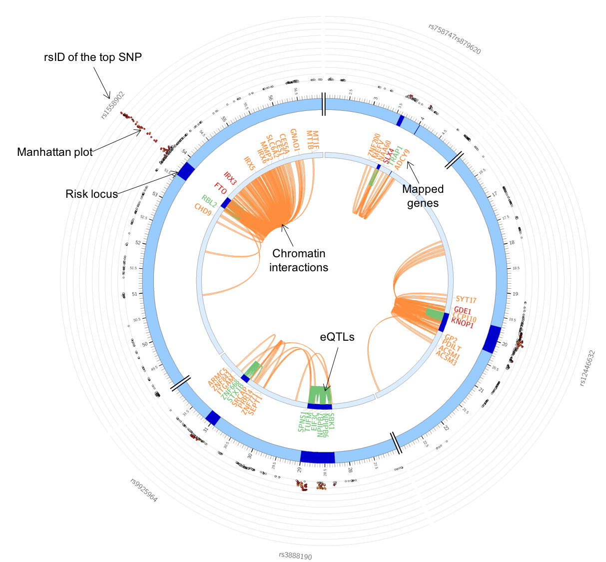

# FUMA circos plot repository

FUMA is an online web application to annotate and prioritize genetic associations.
The application is available from [http://fuma.ctglab.nl](http://fuma.ctglab.nl).

This repository contains config files and detail descriptions of circos plots created on FUMA.
To customize plots, please download config files from FUMA web application and refer wiki pages.

## Repository structure
```
FUMA-circos-plot  
    |-- configs : default config files used on FUMA  
    |-- example : example directory including text files, configs and plots for risk loci of BMI GWAS (2015) on chromosome 16  
    |-- scripts : script to prepare text input files and configs
```
## Wiki menu
* [Home](https://github.com/Kyoko-wtnb/FUMA-circos-plot/wiki)
* [Getting started](https://github.com/Kyoko-wtnb/FUMA-circos-plot/wiki/Getting-started)
* [Prepare input files](https://github.com/Kyoko-wtnb/FUMA-circos-plot/wiki/Preparing-input-files)
* [Customizing plot](https://github.com/Kyoko-wtnb/FUMA-circos-plot/wiki/Customizing-plot)
	* Modify gene labels
	* Change colors
	* Plot a specific locus
	* Plot multiple chromosomes
	* Plot more SNPs or links

## Example plot
The specific layers and color-coding of the circos plot is described below.
* Manhattan plot: The most outer layer. Only SNPs with P < 0.05 are displayed. SNPs in genomic risk loci are color-coded as a function of their maximum r<sup>2</sup> to the one of the independent significant SNPs in the locus, as follows: red (r<sup>2</sup> > 0.8), orange (r<sup>2</sup> > 0.6), green (r<sup>2</sup> > 0.4) and blue (r<sup>2</sup> > 0.2). SNPs that are not in LD with any of the independent significat SNPs (with r<sup>2</sup> &le; 0.2) are grey. The rsID of the top SNPs in each risk locus are displayed in the most outer layer. Y-axis are raned between 0 to the maximum -log10(P-value) of the SNPs.
* Chromosome ring: The second layer. Genomic risk loci are highlighted in blue.
* Mapped genes by chromatin interactions or eQTLs: Only mapped genes by either chroamtin interaction and/or eQTLs (conditional on user defined parameters) are displayed. If the gene is mapped only by chromatin interactions or only by eQTLs, it is colored orange or green, respectively. When the gene is mapped by both, it is colored red.
* Chromosome ring: The third layer. This is the same as second layer but without coordinates to make it easy to align position of genes with genomic coordinate.
* Chromatin interaction links: Links colored orange are chromatin interactions used in the mapping (based on user-defined parameters).</li>
* eQTL lilnks: Links colored green are eQTLs used in the mapping  (based on user-defined parameters).



## Circos software
Software install and circos tutorials are available at [http://circos.ca/](http://circos.ca/).

## License
This repository is licensed under MIT.
